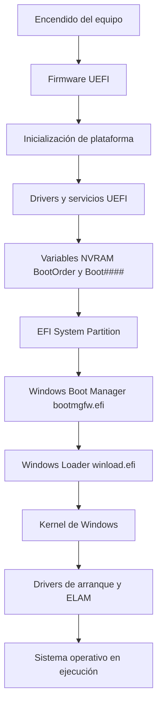
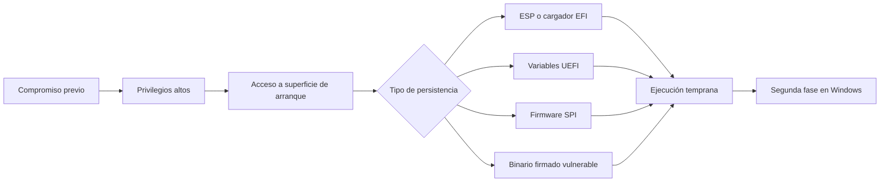
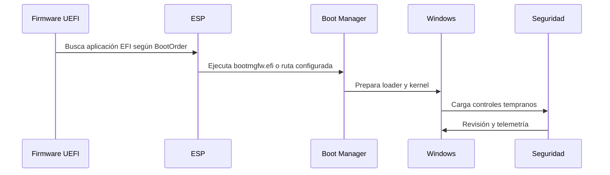

# Bootkits UEFI en Windows: infección del arranque, persistencia y detección

**Alumno:** Diego López
**Módulo:** 10, Reversing en sistemas operativos Windows  
**Actividad:** colaborativa  
**Tema elegido:** proceso de infección del arranque vía Bootkit UEFI

## Índice

1. [Introducción](#1-introducción)
2. [Por qué los bootkits siguen siendo relevantes](#2-por-qué-los-bootkits-siguen-siendo-relevantes)
3. [Arranque UEFI en Windows](#3-arranque-uefi-en-windows)
4. [Diferencia entre bootkit, rootkit y firmware implant](#4-diferencia-entre-bootkit-rootkit-y-firmware-implant)
5. [Superficies que puede atacar un bootkit UEFI](#5-superficies-que-puede-atacar-un-bootkit-uefi)
6. [Modelo de infección a alto nivel](#6-modelo-de-infección-a-alto-nivel)
7. [Persistencia y ejecución temprana](#7-persistencia-y-ejecución-temprana)
8. [Evasión de protecciones modernas](#8-evasión-de-protecciones-modernas)
9. [Casos reales](#9-casos-reales)
10. [Metodología de análisis defensivo](#10-metodología-de-análisis-defensivo)
11. [Indicadores de sospecha](#11-indicadores-de-sospecha)
12. [Propuesta de laboratorio seguro](#12-propuesta-de-laboratorio-seguro)
13. [Respuesta ante un incidente](#13-respuesta-ante-un-incidente)
14. [Conclusiones](#14-conclusiones)
15. [Referencias](#15-referencias)

## 1. Introducción

El objetivo de este trabajo es estudiar cómo encajan los bootkits UEFI dentro de la cadena de arranque de Windows y por qué son una familia especialmente delicada desde el punto de vista del análisis de malware.

Un malware normal suele ejecutarse cuando el sistema operativo ya está levantado. Puede abusar de servicios, tareas programadas, claves de registro, inyección en procesos o drivers vulnerables, pero siempre parte de una base que Windows ya ha inicializado. Un bootkit juega en otro sitio. Su ventaja es intentar ejecutarse antes de que Windows y la mayoría de controles de seguridad estén completamente activos.

Ese cambio de posición lo cambia todo. Si el código malicioso se ejecuta antes del sistema operativo, puede preparar una segunda fase, modificar decisiones de arranque, interferir con validaciones o simplemente sobrevivir en zonas que un formateo normal no toca. Por eso este tema aparece asociado a Secure Boot, PatchGuard, DSE, VBS, BitLocker, TPM y a las distintas fases de confianza que Windows va levantando durante el arranque.

El documento se mantiene en un plano de análisis y defensa. No se incluyen pasos para construir, firmar, instalar o desplegar un bootkit. La idea es entender qué piezas intervienen, qué se ha visto en casos reales y qué puede revisar un analista cuando sospecha que el problema no está solo dentro de Windows, sino antes de Windows.

## 2. Por qué los bootkits siguen siendo relevantes

La época de los bootkits masivos contra MBR quedó bastante atrás, pero la idea no desapareció. Cambió el terreno. Hoy el arranque pasa por UEFI, Secure Boot, bases de datos de firmas, revocaciones, TPM y mecanismos de atestación. Eso eleva mucho el coste técnico, pero también hace que una infección exitosa sea más valiosa.

Hay tres motivos por los que siguen siendo relevantes:

- **Persistencia fuerte:** una infección en firmware o en la partición de arranque puede sobrevivir a acciones que normalmente limpiarían malware de usuario.
- **Ejecución temprana:** el código corre antes que la pila completa de seguridad del sistema operativo.
- **Dificultad de investigación:** muchas herramientas forenses están pensadas para procesos, servicios, registro y disco visible. El firmware y la ESP se revisan menos.

No todos los bootkits tienen el mismo nivel de sofisticación. No es lo mismo modificar la EFI System Partition que implantar código dentro de la SPI flash de la placa base. Aun así, los dos casos obligan a pensar en la cadena de confianza completa y no solo en el estado que muestra Windows después de iniciar sesión.

## 3. Arranque UEFI en Windows

UEFI sustituyó al modelo BIOS clásico. En vez de limitarse a cargar el primer sector de un disco, el firmware UEFI entiende particiones, variables NVRAM, aplicaciones EFI y controladores propios. Esto permite un arranque más flexible, pero también introduce más piezas que hay que proteger.

De forma simplificada, el arranque de Windows en un equipo UEFI sigue esta idea:



La **EFI System Partition**, normalmente abreviada como ESP, es una partición FAT que contiene aplicaciones EFI. En una instalación de Windows suele aparecer una ruta como:

```text
EFI\Microsoft\Boot\bootmgfw.efi
```

El firmware no busca "Windows" como tal. Consulta variables de arranque, localiza una aplicación EFI y le transfiere la ejecución. Esa aplicación continúa la cadena.

Aquí entran varias protecciones:

- **Secure Boot:** valida firmas de componentes UEFI antes de ejecutarlos.
- **Trusted Boot:** continúa la comprobación cuando ya entra la parte de Windows.
- **Measured Boot:** mide componentes de arranque y guarda esas mediciones en el TPM.
- **ELAM:** permite cargar antimalware temprano antes de otros drivers de arranque.
- **BitLocker:** puede reaccionar si cambian mediciones asociadas al arranque.

El problema aparece cuando alguna pieza de esa cadena se modifica, se sustituye, se carga desde una ruta inesperada o sigue siendo aceptada a pesar de ser vulnerable.

## 4. Diferencia entre bootkit, rootkit y firmware implant

Los términos se mezclan a menudo, así que conviene separarlos.

| Concepto | Dónde vive | Momento de ejecución | Objetivo típico |
|---|---|---|---|
| Rootkit kernel | Dentro de Windows, normalmente como driver o modificación kernel | Después de que Windows empieza a cargar kernel y drivers | Ocultación, control de llamadas, manipulación de estructuras |
| Bootkit | Cadena de arranque, ESP o cargadores tempranos | Antes o durante el arranque de Windows | Persistir y preparar ejecución antes del sistema operativo |
| Firmware implant | Firmware UEFI en SPI flash u otro firmware de plataforma | Antes incluso de leer el disco | Persistencia fuera del disco y control muy temprano |

Un bootkit puede acabar cargando un rootkit kernel como segunda fase. Un firmware implant puede restaurar un bootkit en disco. Las categorías no son compartimentos cerrados, pero ayudan a ordenar el análisis.

## 5. Superficies que puede atacar un bootkit UEFI

La cadena de arranque tiene varias zonas sensibles. No todas son igual de realistas en un ataque moderno, pero todas han aparecido de una forma u otra en investigación pública.

### 5.1 EFI System Partition

La ESP es atractiva porque está en disco y contiene los binarios EFI que participan en el arranque. Una amenaza podría intentar colocar un cargador adicional, modificar rutas de arranque o interferir con el flujo normal.

En una revisión defensiva, la ESP se puede comparar con una referencia limpia. No hace falta asumir que todo cambio es malicioso, porque Windows y algunos fabricantes actualizan esta partición, pero sí merece revisión cualquier binario desconocido, duplicado o con nombre parecido al original.

### 5.2 Variables UEFI

UEFI usa variables NVRAM para guardar orden de arranque, rutas y configuración. Entradas como `BootOrder` o `Boot####` pueden indicar qué aplicación EFI se va a ejecutar.

Un cambio extraño en estas variables puede hacer que el firmware cargue otro binario antes que el esperado. Para un analista, revisar estas entradas ayuda a saber si el equipo arranca realmente desde la ruta que parece.

### 5.3 Firmware en SPI flash

La SPI flash guarda el firmware de la placa. Una infección aquí es mucho más seria que una modificación de la ESP, porque puede sobrevivir al cambio de disco o a la reinstalación completa de Windows.

El análisis de firmware suele requerir herramientas específicas, comparación con imágenes oficiales y, en casos complejos, extracción offline. Es una zona donde conviene ser prudente: un sistema comprometido no siempre puede usarse como fuente fiable para comprobarse a sí mismo.

### 5.4 Binarios firmados vulnerables

Secure Boot confía en firmas y revocaciones. Si un binario firmado contiene una vulnerabilidad y sigue estando permitido por la base de datos de arranque, puede convertirse en una pieza débil de la cadena.

BlackLotus es el ejemplo más claro de por qué no basta con "tener Secure Boot activado". También hay que mantener actualizada la base de datos de revocación, conocida como `dbx`.

### 5.5 Drivers vulnerables

Otra vía indirecta es abusar de drivers vulnerables desde Windows para obtener capacidad de escritura o manipulación que normalmente no estaría disponible. No convierte al driver en bootkit por sí mismo, pero puede servir como paso previo para modificar elementos de arranque o firmware.

## 6. Modelo de infección a alto nivel

Sin entrar en una receta operativa, una infección de este tipo suele necesitar primero una posición privilegiada. Puede venir de acceso físico, credenciales administrativas, una cadena previa de malware, explotación local o abuso de un driver vulnerable.

Una vez conseguido ese punto inicial, el atacante buscaría persistir en una zona temprana de arranque. El esquema general sería:



Lo importante para el análisis es que la segunda fase visible puede no explicar el origen de la infección. Un driver raro, un servicio que reaparece o una configuración de seguridad deshabilitada pueden ser síntomas. La causa puede estar en la cadena de arranque.

## 7. Persistencia y ejecución temprana

La persistencia de un bootkit no tiene por qué parecerse a la persistencia clásica de malware. En vez de una clave `Run` o una tarea programada, puede estar en:

- Un binario EFI añadido o reemplazado.
- Una entrada de arranque UEFI modificada.
- Un cargador vulnerable que sigue aceptado por Secure Boot.
- Un componente dentro de firmware.
- Un mecanismo que restaura payloads después de limpiar Windows.

La ejecución temprana tiene otra consecuencia: el malware puede actuar antes de que muchas herramientas de usuario tengan visibilidad. Por eso el análisis debe mirar hacia abajo en la pila, no solo hacia arriba.

Una forma sencilla de verlo:



Si una pieza maliciosa entra antes de `BM` o durante esa transición, la seguridad posterior puede ver un estado ya condicionado.

## 8. Evasión de protecciones modernas

Windows moderno no deja esta zona sin proteger. El punto interesante de los bootkits actuales es que suelen intentar colocarse en huecos entre protecciones, configuraciones incompletas o componentes no revocados.

### 8.1 Secure Boot

Secure Boot valida que los componentes de arranque estén firmados por una entidad de confianza. Si está desactivado, mal configurado o con revocaciones antiguas, la cadena pierde mucha fuerza.

El caso práctico importante es que Secure Boot no es un interruptor mágico. Hay que comprobar:

- Que está activado.
- Que no está en modo Setup.
- Que las claves son las esperadas.
- Que `dbx` está actualizada.
- Que no se usan cargadores vulnerables todavía aceptados.

### 8.2 Driver Signature Enforcement

DSE impide cargar drivers kernel no firmados en Windows. Algunos bootkits han intentado debilitar esta protección durante el arranque para que una segunda fase pueda cargar código kernel después.

### 8.3 PatchGuard

PatchGuard protege estructuras críticas del kernel frente a modificaciones no autorizadas. No evita por sí mismo todos los bootkits, pero complica la vida a una segunda fase kernel que intente manipular tablas, callbacks o listas internas.

### 8.4 VBS, HVCI y TPM

Virtualization Based Security, Hypervisor-protected Code Integrity y las mediciones TPM elevan el coste de manipular el sistema. No eliminan el problema, pero ayudan mucho si están bien configuradas y si la organización revisa sus señales.

## 9. Casos reales

### 9.1 LoJax

LoJax fue documentado por ESET en 2018 y se suele citar como el primer UEFI rootkit observado en una campaña real. Lo interesante no es solo la técnica, sino el salto conceptual: UEFI dejó de ser únicamente terreno de conferencias y pruebas de concepto.

Para defensa, LoJax dejó una lección clara. Si una amenaza alcanza firmware, reinstalar Windows o cambiar el disco puede no resolver el problema. La limpieza debe incluir firmware y cadena de arranque.

### 9.2 MosaicRegressor

Kaspersky publicó MosaicRegressor en 2020. El caso se relacionó con un implante UEFI basado en componentes derivados de VectorEDK. De nuevo, la parte importante para un analista es la persistencia fuera del disco y la capacidad de entregar una fase posterior.

No es el tipo de amenaza que se detecta mirando solo procesos. Requiere pensar en firmware, integridad de plataforma y comparación con imágenes de referencia.

### 9.3 ESPecter

ESPecter, analizado por ESET, es útil porque se centra en la EFI System Partition. Es una superficie más cercana que la SPI flash y por eso encaja bien en un laboratorio defensivo.

El caso muestra que la ESP merece formar parte del triage. Muchas veces se revisa `System32`, servicios y registro, pero se olvida mirar qué hay realmente en la partición desde la que arranca el equipo.

### 9.4 MoonBounce

MoonBounce, publicado por Kaspersky en 2022, destaca por su aproximación firmware. En vez de añadir un archivo llamativo en disco, el implante se oculta dentro del firmware.

Esto complica la investigación porque no basta con listar archivos. Hay que comparar firmware, analizar módulos UEFI y valorar si la placa puede seguir considerándose confiable.

### 9.5 BlackLotus

BlackLotus confirmó que un bypass de Secure Boot podía convertirse en una amenaza realista. Se relacionó con CVE-2022-21894 y con el abuso de binarios firmados vulnerables.

La conclusión práctica es bastante incómoda: activar Secure Boot no basta si la plataforma sigue confiando en componentes que deberían estar revocados. En entornos empresariales, revisar `dbx` y aplicar mitigaciones de Microsoft se vuelve parte de la defensa, no un detalle opcional.

| Caso | Año | Superficie principal | Idea defensiva que deja |
|---|---:|---|---|
| LoJax | 2018 | Firmware UEFI | El firmware puede ser persistencia real, no solo teoría |
| MosaicRegressor | 2020 | Firmware UEFI | Comparar firmware empieza a ser necesario en incidentes serios |
| ESPecter | 2021 | ESP | La partición de arranque también se analiza |
| MoonBounce | 2022 | SPI flash | Un implante puede esconderse dentro de firmware existente |
| BlackLotus | 2023 | Secure Boot bypass | Secure Boot necesita revocaciones al día |

## 10. Metodología de análisis defensivo

La investigación de un posible bootkit no debería empezar borrando ni reparando. Primero hay que preservar evidencias. Si se toca el firmware, la ESP o las variables de arranque sin capturar nada, se pierde justo lo más valioso.

### 10.1 Información inicial

Preguntas básicas:

- ¿Secure Boot está activado?
- ¿BitLocker ha pedido recuperación recientemente?
- ¿Hubo actualización de firmware o de Windows?
- ¿El equipo arranca desde la ruta esperada?
- ¿Hay EDR o Defender alertando de cambios en arranque?
- ¿La persistencia reaparece después de reinstalar?

### 10.2 Revisión de la ESP

La ESP debería copiarse y analizarse offline si es posible. Puntos a revisar:

- Árbol de directorios.
- Hashes de binarios EFI.
- Firmas digitales.
- Fechas de modificación.
- Binarios duplicados o con nombres parecidos.
- Rutas que no correspondan al fabricante o a Windows.

Un ejemplo de estructura esperada en Windows sería:

```text
EFI\
  Microsoft\
    Boot\
      bootmgfw.efi
      BCD
```

No significa que cualquier archivo extra sea malicioso. Muchos fabricantes añaden herramientas propias. Lo importante es poder explicarlo.

### 10.3 Variables UEFI y BCD

Las variables de arranque y la configuración BCD ayudan a responder una pregunta simple: qué se ejecuta realmente al arrancar.

Se revisarían:

- `BootOrder`
- entradas `Boot####`
- rutas de cada entrada
- configuración BCD
- cambios recientes en orden de arranque

### 10.4 Firmware

En sospechas altas, la comparación de firmware es clave. Lo ideal es contrastar:

- versión instalada
- imagen oficial del fabricante
- módulos añadidos o modificados
- diferencias no explicadas por configuración
- presencia de componentes conocidos de proyectos UEFI reutilizados

Esta parte requiere cuidado. Un firmware extraído desde un sistema comprometido puede no ser la mejor fuente. En investigaciones serias se valora extracción externa.

### 10.5 Señales dentro de Windows

Aunque el origen esté antes de Windows, pueden quedar síntomas dentro del sistema:

- drivers de arranque inesperados
- servicios kernel recientes
- DSE o HVCI deshabilitados
- eventos de Secure Boot
- cambios en BitLocker
- reinfección después de limpieza
- payloads restaurados tras reiniciar

La clave es no quedarse en el síntoma. Si algo reaparece, hay que buscar el restaurador.

## 11. Indicadores de sospecha

Lista práctica de señales que justificarían mirar más a fondo:

- Secure Boot desactivado sin motivo claro.
- `dbx` sin actualizar en un equipo que debería estar al día.
- Entradas de arranque con rutas raras o nombres demasiado genéricos.
- Archivos EFI añadidos o modificados fuera de una actualización conocida.
- BitLocker pidiendo clave de recuperación después de cambios no explicados.
- Drivers kernel nuevos justo después de eventos de arranque anómalos.
- Persistencia que vuelve tras reinstalar Windows.
- Diferencias entre firmware instalado e imagen oficial.
- EDR avisando de manipulación de arranque, DSE, HVCI o drivers tempranos.

Ninguna señal aislada demuestra infección. Lo normal en análisis es acumular piezas. Un archivo raro en la ESP puede ser una utilidad OEM. Secure Boot desactivado puede venir de una decisión administrativa mala. El problema empieza cuando varias señales apuntan al mismo sitio.

## 12. Propuesta de laboratorio seguro

Para practicar sin tocar malware real, plantearía un laboratorio de baseline:

1. Crear una VM Windows 11.
2. Activar Secure Boot si la plataforma lo permite.
3. Activar BitLocker o al menos registrar estado TPM.
4. Copiar la ESP.
5. Calcular hashes de binarios EFI.
6. Exportar BCD y entradas de arranque.
7. Guardar versión de firmware y configuración de seguridad.
8. Aplicar una actualización legítima.
9. Repetir capturas.
10. Comparar qué cambia y qué no.

El aprendizaje sale de tener una referencia limpia. Si se entiende cómo cambia el sistema en una actualización normal, es más fácil reconocer un cambio raro en un incidente.

La práctica no necesita ejecutar un bootkit. De hecho, para una formación defensiva tiene más valor aprender a documentar el estado sano y reconocer desviaciones.

## 13. Respuesta ante un incidente

Si la sospecha es baja, puede bastar con revisar ESP, BCD, Secure Boot, eventos y drivers. Si la sospecha es alta, el enfoque cambia:

- Preservar disco y ESP antes de reparar.
- Guardar configuración UEFI y estado de Secure Boot.
- Revisar BitLocker y mediciones TPM si están disponibles.
- Actualizar `dbx` y aplicar mitigaciones del fabricante o Microsoft.
- Reflashear firmware desde una fuente confiable.
- Reinstalar Windows solo después de tratar la capa de arranque.
- Rotar credenciales usadas en el equipo.
- Sustituir placa si no se puede garantizar limpieza del firmware.

La frase importante es esta: reinstalar Windows no arregla necesariamente una infección que vive antes que Windows.

## 14. Conclusiones

Los bootkits UEFI son interesantes porque obligan a mirar la seguridad como una cadena, no como una lista de procesos. Si una pieza temprana falla, todo lo que viene después puede estar condicionado.

La defensa moderna ha mejorado mucho. Secure Boot, Trusted Boot, TPM, BitLocker, ELAM, DSE, PatchGuard, VBS y HVCI hacen que este tipo de malware sea más difícil de desplegar. Aun así, los casos reales demuestran que sigue siendo posible cuando hay configuraciones débiles, firmware desactualizado, revocaciones incompletas o componentes vulnerables aceptados por la cadena.

Para un analista, la lección principal es no quedarse en el sistema operativo visible. En incidentes persistentes hay que revisar también la ESP, variables de arranque, firmware, estado de revocaciones y señales de arranque. La pregunta no es solo qué se está ejecutando en Windows, sino si Windows arrancó desde una base confiable.

## 15. Referencias

- Microsoft Learn. Secure the Windows boot process.  
  https://learn.microsoft.com/en-us/windows/security/operating-system-security/system-security/secure-the-windows-10-boot-process

- Microsoft Learn. Secure Boot and Trusted Boot.  
  https://learn.microsoft.com/en-us/windows/security/operating-system-security/system-security/trusted-boot

- Microsoft Learn. Secure boot for OEMs.  
  https://learn.microsoft.com/en-us/windows-hardware/design/device-experiences/oem-secure-boot

- Microsoft Security Blog. Guidance for investigating attacks using CVE-2022-21894, the BlackLotus campaign.  
  https://www.microsoft.com/en-us/security/blog/2023/04/11/guidance-for-investigating-attacks-using-cve-2022-21894-the-blacklotus-campaign/

- ESET. LoJax, first UEFI rootkit found in the wild.  
  https://www.welivesecurity.com/2018/09/27/lojax-first-uefi-rootkit-found-wild-courtesy-sednit-group/

- ESET. UEFI threats moving to the ESP: introducing ESPecter bootkit.  
  https://www.welivesecurity.com/2021/10/05/uefi-threats-moving-esp-introducing-especter-bootkit/

- ESET. BlackLotus UEFI bootkit: myth confirmed.  
  https://www.welivesecurity.com/2023/03/01/blacklotus-uefi-bootkit-myth-confirmed/

- Kaspersky Securelist. MosaicRegressor: Lurking in the shadows of UEFI.  
  https://securelist.com/mosaicregressor/98849/

- Kaspersky Securelist. MoonBounce: the dark side of UEFI firmware.  
  https://securelist.com/moonbounce-the-dark-side-of-uefi-firmware/105468/

- Binarly. UEFI bootkit hunting: in depth search for unique code behavior.  
  https://www.binarly.io/blog/uefi-bootkit-hunting-in-depth-search-for-unique-code-behavior

- Manual del módulo 10. Reversing en sistemas operativos Windows.
